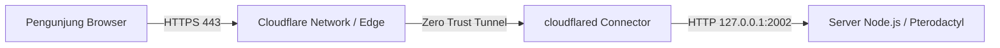

# 🌐 Panduan Lengkap Pemasangan SSL & Cloudflare Tunnel
## NoxariaNet Wallet (`noxarianet.biz.id`)

Dokumen ini berisi panduan teknis dan dokumentasi lengkap mengenai cara mengonfigurasi **SSL HTTPS** dan **Cloudflare Tunnel (Zero Trust)** pada proyek NoxariaNet Wallet yang di-deploy di **Pterodactyl Panel** (port `2002`).

---

## 📌 Ringkasan Arsitektur



- **Domain Utama:** `https://noxarianet.biz.id`
- **Port Internal Aplikasi:** `2002`
- **Protokol Eksternal:** `HTTPS` (SSL otomatis dari Cloudflare)
- **Sistem Database:** Dual Sync (SQLite3 dengan Fallback Otomatis ke JSON DB)

---

## 🛠️ Metode Utama: Cloudflare Tunnel (Zero Trust)

Metode ini adalah cara paling **aman dan praktis** karena:
- Tidak perlu membuka port 2002 pada firewall VPS.
- Sertifikat SSL disedia dan dikelola otomatis oleh Cloudflare.
- Mencegah serangan DDoS langsung ke IP asli VPS.

---

### Langkah 1: Buat Tunnel di Cloudflare Zero Trust
1. Buka [Cloudflare Zero Trust Dashboard](https://one.dash.cloudflare.com/).
2. Masuk ke menu **Networks** -> **Tunnels** -> Klik **Add a Tunnel**.
3. Pilih tipe **Cloudflared** dan beri nama tunnel (contoh: `noxarianet-panel`).
4. Pada halaman *Install cloudflared connector*, salin **Token Tunnel** yang dihasilkan (string panjang diawali `eyJ...`).

---

### Langkah 2: Konfigurasi Token pada Server (`.env`)
Buka file `.env` di folder utama proyek dan tambahkan baris berikut:

```env
PORT=2002
NODE_ENV=production
DATABASE_FILE=data.sqlite

# CLOUDFLARE TUNNEL TOKEN
CLOUDFLARE_TUNNEL_TOKEN=eyJ...[MASUKKAN_TOKEN_LENGKAP_KAMU]...
```

---

### Langkah 3: Konfigurasi Route / Public Hostname di Cloudflare
1. Pada halaman Tunnel di Cloudflare Dashboard, klik **Add a route** -> pilih **Published Application**.
2. Isi formulir aplikasi sebagai berikut:
   - **Subdomain:** *(Kosongkan untuk domain utama)*
   - **Domain:** `noxarianet.biz.id`
   - **Path:** *(Kosongkan)*
   - **Type / Service:** `HTTP`
   - **URL:** `http://127.0.0.1:2002` (atau `http://localhost:2002`)
3. Klik **Save Route**.

---

### Langkah 4: Otomatisasi Cloudflare Tunnel pada Kode Backend (`server.js`)
Proyek ini sudah dilengkapi dengan **Auto-Launch Cloudflare Tunnel** langsung dari `server.js`. Saat `npm start` dijalankan di Pterodactyl, `server.js` akan membuka port `2002` terlebih dahulu, lalu otomatis memanggil `cloudflared` di background.

Kode otomatisasi pada `server.js`:

```javascript
// Start Combined Server
app.listen(PORT, HOST, () => {
  console.log(`================================================================`);
  console.log(`✅ NoxaPay & SekaliPay Top-Up Server ONLINE`);
  console.log(`   Internal  : http://localhost:${PORT}`);
  console.log(`   External  : http://203.175.125.151:${PORT}`);
  console.log(`================================================================`);

  // Launch Cloudflare Tunnel otomatis jika token tersedia
  const tunnelToken = process.env.CLOUDFLARE_TUNNEL_TOKEN;
  if (tunnelToken) {
    console.log('[Cloudflare Tunnel] Launching automatic tunnel process...');
    const binPath = fs.existsSync(path.join(__dirname, 'cloudflared')) ? './cloudflared' : 'cloudflared';
    const tunnelProc = exec(`${binPath} tunnel run --token "${tunnelToken}"`);
    
    if (tunnelProc.stderr) {
      tunnelProc.stderr.on('data', data => {
        const str = data.toString().trim();
        if (str.includes('Registered tunnel connection')) {
          console.log(`[Tunnel SUCCESS] Cloudflare Tunnel connected!`);
        } else if (str.includes('ERR')) {
          console.error(`[Tunnel Error] ${str}`);
        }
      });
    }
  }
});
```

---

## 🔄 Metode Alternatif: Cloudflare Origin Rules (Tanpa Binary Tunnel)

Jika tidak ingin menjalankan binary `cloudflared` di server, Anda dapat menggunakan fitur **Origin Rules**:

1. **DNS Setup:**
   - Type: `A`
   - Name: `@` (`noxarianet.biz.id`)
   - IPv4 Address: `IP_SERVER_VPS`
   - Proxy Status: **Proxied** (Awan Oranye `ON`)

2. **SSL/TLS Encryption Mode:**
   - Buka **SSL/TLS** -> **Overview** -> Pilih Mode **Flexible**.

3. **Origin Rules (Port Rewrite):**
   - Buka **Rules** -> **Origin Rules** -> **Create Rule**.
   - Expression: `Hostname equals noxarianet.biz.id`
   - Destination Port Rewrite to: `2002`

---

## 🛠️ Catatan Troubleshooting & Solusi Kendala

| Error / Gejala | Penyebab Utama | Solusi Yang Telah Diterapkan |
| :--- | :--- | :--- |
| `ERR_DLOPEN_FAILED: invalid ELF header / sqlite3` | Container Pterodactyl menggunakan **Node.js v24** yang belum mendukung binary native SQLite3 versi Linux. | `database.js` telah diperbarui dengan *try-catch fallback*. Jika SQLite3 tidak bisa dimuat, server otomatis beralih ke **JSON File DB** tanpa crash. |
| `dial tcp 127.0.0.1:2002: connection refused` | Perintah `cloudflared` dijalankan manual di terminal saat `server.js` belum berjalan/mati. | Tunnel telah diotomatisasi di `server.js` agar menyala *setelah* server Express siap mendengarkan port 2002. |
| `Provided Tunnel token is not valid` | String token pada `.env` terpotong saat di-copy paste di terminal. | Gunakan token utuh diawali `eyJ...` yang dibungkus tanda petik ganda dalam file `.env`. |

---

## 🔗 URL Endpoint Penting setelah SSL Aktif

- **Website Utama:** `https://noxarianet.biz.id`
- **Dashboard Admin:** `https://noxarianet.biz.id/admin`
- **Webhook SekaliPay:** `https://noxarianet.biz.id/api/sekalipay/webhook`
- **Callback Orkut QRIS:** `https://noxarianet.biz.id/api/orkut/callback`

---
*Dokumentasi ini dibuat otomatis untuk pemeliharaan sistem NoxariaNet Wallet.*
